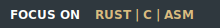

<!-- Header -->

I'm os developer (low-level programming) i'm from Germany/bavaria...  
My projects are mostly built from scratch like my XPL2 bootloader and kernel,   
i enjoy exploring how computers work at the low level   
but I also have a passion for web design, especially crafting sleek and engaging layouts with CSS  
 
and i love the Everforest theme.. I like simplicity and clarity in literally everything...
i hope you enjoy my projects :D
 
 

<!-- Badges -->

    
    
   
  

# 

 
   <!-- Left Column --> 
    
   
 
       
       
       
       
       
       
       
         
      i learned C and ASM for my biggest project, 
       
      emexOS a simple 64 bit OS 
         
       
   
 

<!-- Footer -->

